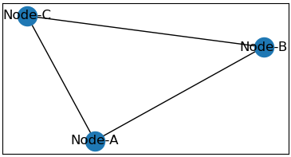
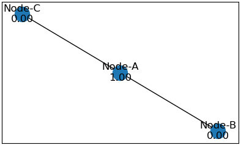
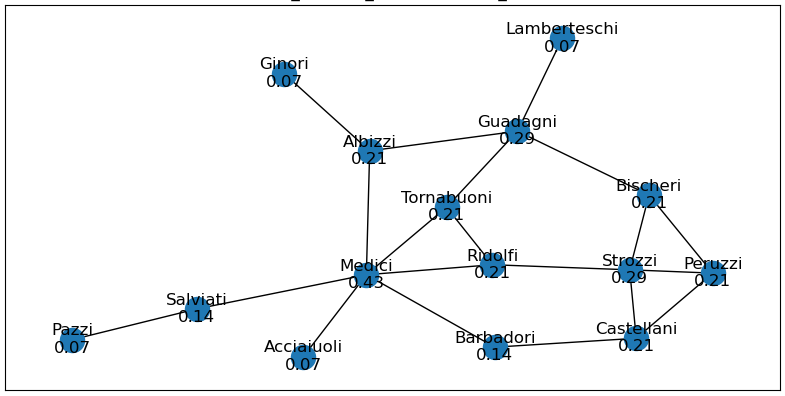
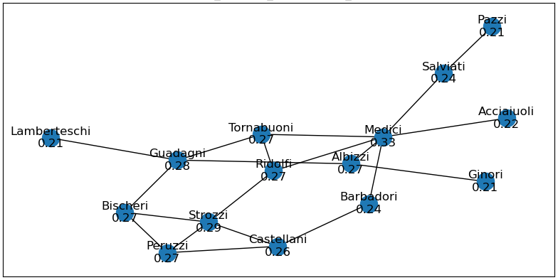
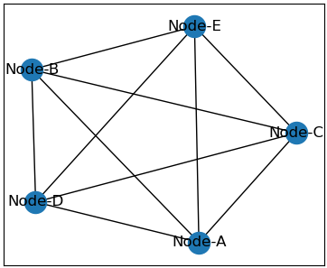
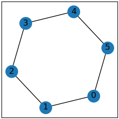

# Glossary of Network Terms

## Symbols Defined

The following symbols are standardized:

|Symbol|Definition|
|---:|:---:|
|$\mathscr{G}$|Network or Graph|
|$\mathscr{N} = (n_{1}, n_{2}, ..., n_{g})$|Nodes (aka: actors, vertices, etc) in $\mathscr{G}$|
|$g$|Number of nodes in $\mathscr{G}$|
|$\mathscr{L} = (l_{1}, l_{2}, ..., l_{L})$|Lines (aka: edges, ties, links, etc) in $\mathscr{G}$|
|$L$|Number of lines in a $\mathscr{G}$|
|$l_{k} = (n_{i}, n_{j})$|A distinct line and its node pair|
|$d(n_{i})$|A node's *degree*|
|$\bar{d}$|*Mean* node degree in $\mathscr{G}$|
|$S_{D}^{2}$|*Variance* of $\mathscr{G}$'s node degrees|
|$\Delta$|*Density* of $\mathscr{G}$|
|$C$|*Centrality* measures|
|$C_{A}(n_{i})$|A specific *centrality* measure, $A$, for the node $n_{i}$|
|$C_{A}(n^{*})$|The largest value for th centrality measure $A$ in this specific $\mathscr{G}$; or $\max_{i} C_{A}(n_{i})$|

### Adjacency Matrix

A common data structure used to represent a network.

The rows and columns are nodes, and the cells represent their relatedness.

More formally it is an $n \times n$ matrix $g$ where a node is $g_{ij}$ with a value of $0$ if unrelated and $\gt 0$ when related in some way.

##### Example

For the network with nodes $N = ({\text{Node-A},\space\text{Node-B},\space\text{Node-C}})$ and this adjacency matrix:

$$
g = \begin{pmatrix} 0 & 1 & 1 \\
    1 & 0 & 1 \\
    1 & 1 & 0
\end{pmatrix}
$$

gives this network:

## Centrality

*Centrality* is a measure of a node's "importance" in the network.

Common measures are:

- Degree
- Closeness
- Betweenness
- Decay, Katz, Eigenvector, ...

#### Example

<table>
  <tr>
    <th colspan="3">Centralities</th>
  </tr>
  <tr>
    <td colspan="3" align="center"></td>
  </tr>
  <tr>
    <td><b>Degree:</b> Node 1 - 0.44</td>
    <td><b>Closeness:</b> Node 2 - 0.46</td>
    <td><b>Betweenness:</b> Node 3 - 0.65</td>
  </tr>
</table>

### Betweenness (Centrality)

*Betweenness* identifies nodes which "control" flow.

So, a node $k$ stands in-*between* nodes $i$ and $j$ if is part of a path between the two.

The formal definition is:

$$
Centrality_{k}^{B} = \sum_{i,j \not = k} \frac {\sigma_{k}(i,j)} {\sigma(i,j)}
$$

where $\sigma$ is the number of shortest paths between 2 nodes, here $i$ and $j$ and $\sigma_{k}$ is the number of shortest paths between $i$ and $j$ in which $k$ participates.

||Only `Node-A`| No Nodes|
|:-:|:-:|:-:|
||||

### Closeness (Centrality)

*Closeness* identifies nodes "nearer" -- lower path length -- to all other nodes.

$$
Centrality^{C}_{i} = \frac {n-1} {\sum_{i,j} l(i, j)}
$$

Ref: https://en.wikipedia.org/wiki/Closeness_centrality

### Decay Centrality

A measure of a node's important where distance to another node attenuates. It is similar to closeness but the "weight" of edges is $0 \lt \delta \lt 1$.

$$
Centrality_{i}^{\delta} = \frac {\delta(n-1)} {\sum \delta^{l_{i}}}
$$

### Degree Centrality

Degree centrality measures the node's importance on the number of edges it has.

$$Centrality^{D}_{i} = \frac {d(i)} {n-1} $$

##### Lessons

[101](https://github.com/czrpb/networkanalysis/blob/main/learning/na101-basics/learn.md#degree)

### Examples

##### Kite Network

A *kite* network is a very basic network useful to see some basic network properties. Here is such a network annotated with centrality measures.

||Degree|Closeness|
|:-:|:-:|:-:|
||||
||**Betweenness**|**Decay (Katz)**|
||||

##### Florentine Families

The Florentine Families network is a small and often used dataset to explore influence. The Medici family was quite powerful during this time through a series of strategic marriages.

Exploring this dataset via centrality measures reveals this and other interesting network features/families.

||Degree|Closeness|
|:-:|:-:|:-:|
||||
||**Betweenness**|**Decay (Katz)**|
||||
||||

###### References

Historical Description of the Medici family, others, and the time

https://www.destinationflorence.com/en/blog/292-the-medici-dynasty-the-intriguing-and-influential-florentine-family

https://en.wikipedia.org/wiki/House_of_Medici

Original social network analysis paper on these relationships

???

Dataset(s) and Tools

http://www.casos.cs.cmu.edu/computational_tools/datasets/external/padgett/index2.html

https://datarepository.wolframcloud.com/resources/Florentine-Families-Network/

https://www.wolfram.com/mathematica/new-in-9/social-network-analysis/centrality-and-prestige-of-florentine-families.html

https://networkx.org/documentation/latest/reference/generated/networkx.generators.social.florentine_families_graph.html#networkx.generators.social.florentine_families_graph

##### Lessons

[101](https://github.com/czrpb/networkanalysis/blob/main/learning/na101-basics/learn.md#centrality)

### Circle

A network with 1 cycle where all nodes are of degree 2.

### Clique

A maximally complete subnetwork.

See *Triangle*

### Closed Triad

A 3 node cycle.

##### Lessons

[101](https://github.com/czrpb/networkanalysis/blob/main/learning/na101-basics/learn.md#closeness)

### Clustering Coefficient

The ratio of closed triads to all triads.

### Complete

A network where there exists a dyad between all nodes.

### Component

A connected set of nodes in a network where there are $\geq 2$ such sets.

#### Weakly Connected Component

In an undirected network, a set of nodes such that a path exists between all pairs of nodes.

$$
S_{i,j} \subset g = \forall_{i,j} \space \exists \space p_{i,j}
$$

#### Strongly Connected Component

The same as weakly connected but for directed networks.

### Connected

A network where there exists a path for all pairs of nodes.

### Cycle

A path that starts and ends at the same node.

See *Path*, *Walk*, *Geodesic*.

### Degree

The number of edges connected to a node.

##### Lessons

[101](https://github.com/czrpb/networkanalysis/blob/main/learning/na101-basics/learn.md#degree)

### Density

A maximally dense network would be a complete network, thus density is:

$$
\frac {Avg(d)} {n-1}
$$

##### Lessons

### Diameter

The length of the largest distance between 2 nodes $i$ and $j$. Also, may be defined as the maximum eccentricity for all dyads in a graph $g$.

See: *Eccentricity*, *Radius*

### Digraph

See *Network*, specifically *Directed*.

### Distance

The number of edges of a path $d_{i,j}$ between 2 nodes $i$ and $j$.

Aliases: *Length*

See: *Eccentricity*, *Radius*

### Dyad

Two nodes $i$ and $j$ connect by an edge $e_{i,j}$.

### Eccentricity

The maximum distance from a node $i$ to node $j$ where $j$ is all other nodes in the graph $g$.

See: *Diameter*, *Radius*

### Edge

An *edge* is the relationship in a *dyad*.

Aliases: *Tie*

### Edge List

A common data structure to represent a network, implemented as a *list of 2-tuples*: `[(Node-A, Node-B), (Node-A, Node-C), (Node-B, Node-C)]`.

### Ego

Ego is often used as the "name" of or reference to a specific node that is under investigation.

### Forest

A set of tree components.

### Geodesic

A shortest path between 2 nodes.

See *Path*, *Walk*, *Cycle*.

#### Mean Geodesic

The mean geodesic $\bar{l}$ is the average path length. There are 2 ways to think of this:

*From a random node* $i$:

- And another random node $j$, what is the expected number of edges?
- If the nodes are say webpages, how many clicks are expected to another random page?

Formally:

$$
\bar{l} = \frac {\sum_{i \not = j} d(i,j)} {n(n-1)}
$$

> Divide the sum of the distances between all dyads by the number of possible dyads.

||Star|Cycle|Complete|
|---|---|---|---|
|||||
||||1|

### Length

Alias for: *Distance*

### Multi-mode/Multimodal (Network)

A network with multiple "types" of nodes.

### Multiplex (Network)

A network with multiple "types" of edges (links).

### Neighbors

The set of nodes connected (by an edge) to a node.

### Network

A set of nodes connected by edges.

A network may be *undirected* or *directed*:

- Undirected: the relation between dyads' is symmetric/bi-directional
  - Social relations and economics are common examples
- Directed: the relation between dyads' is directional
  - Webpages and citations are common examples

Aliases: *Graph*

### Node

A node is one of the 2 primitive elements of a network.

Nodes are usually "things" or nouns such as:

- People - when part of a social network; other examples include:
  - Plants and animals in an ecosystem
  - Social media
- Computers - when part of a physical network; other examples include:
  - Cities, ports, stores, etc - as part of a transportation, distribution, supply chain
- Webpages - when part of an informational network; other examples include:
  - Academic papers, movie actors, 

Nodes are connected or related to each other via edges.

Aliases: *Vertex*

### Path

A path is a set of edges that connect 2 nodes, without repeating nodes.

See *Walk*, *Geodesic*, *Cycle*.

### Relation

A *relation* is a connection between 2 nodes in a network. Common terms for this are *link*/*tie* in sociological literature and *edge* from graph theory.

#### Bridge

A *bridge* is a tie such that when removed increases the number of components in the network.

A good, though not the only, example in the following network would be $\text{Node-Z}$:

when removed results in:

### Star

A network where there is 1 node connected to all other nodes and no other dyads exist.

### Tie

Alias for: *Edge*.

### Transitivity

The ratio of actual triangles in a network against the total possible.

### Tree

A network where there are no cycles.

### Triadic Closure

One of the 16 types (motifs) of connection patterns among 3 nodes.

### Triangle

The smallest possible clique.

See *Clique*.

### Vertex

Alias for: *Node*.

### Walk

A walk is a set of edges that connect 2 nodes, possibly repeating nodes.

See *Path*, *Geodesic*, *Cycle*.
