# Glossary of Network Terms

### Adjacency Matrix

A common data structure used to represent a network.

The rows and columns are nodes, and the cells represent their relatedness.

More formally it is an $n \times n$ matrix $g$ where a node is $g_{ij}$ with a value of $0$ if unrelated and $\gt 0$ when related in some way.

##### Example

For the network with nodes $N = ({\text{Node-A},\space\text{Node-B},\space\text{Node-C}})$ and this adjacency matrix:

$$
g =\begin{pmatrix}
0 & 1 & 1 \\
1 & 0 & 1 \\
1 & 1 & 0
\end{pmatrix}
$$

gives this network:

### Bridge

A node in a network such that if removed increases the number of components in the network.

A good, though not the only, example in the following network would be $\text{Node-Z}$:

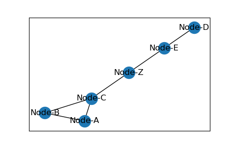

when removed results in:

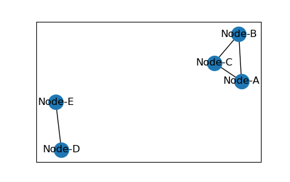

### Centrality

*Centrality* is a measure of a node's "importance" in the network.

Common measures are:

- Degree
- Closeness
- Betweenness
- Katz or Decay

##### Kite Network

A *kite* network is a very basic network useful to see some basic network properties. Here is such a network annotated with centrality measures.

||Degree|Closeness|
|:-:|:-:|:-:|
||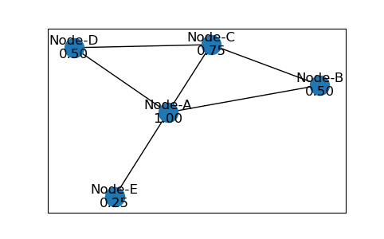|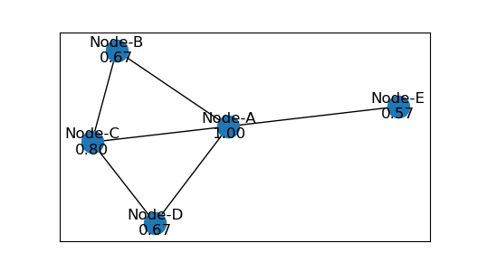|
||**Betweenness**|**Decay (Katz)**|
||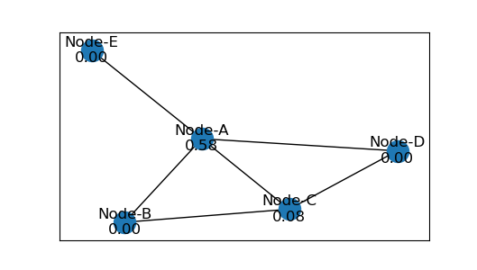|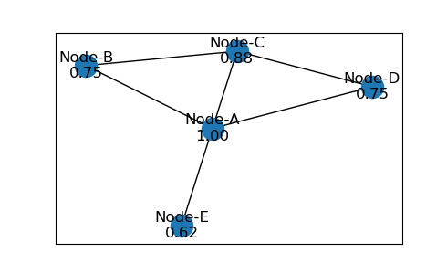|

##### Florentine Families

The Florentine Families network is a small and often used dataset to explore influence. The Medici family was quite powerful during this time through a series of strategic marriages.

Exploring this dataset via centrality measures reveals this and other interesting network features/families.

||Degree|Closeness|
|:-:|:-:|:-:|
||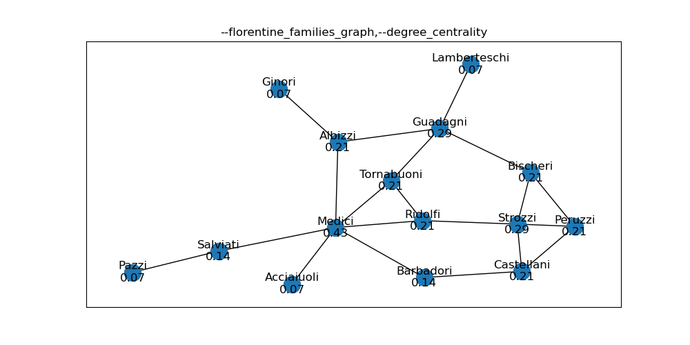|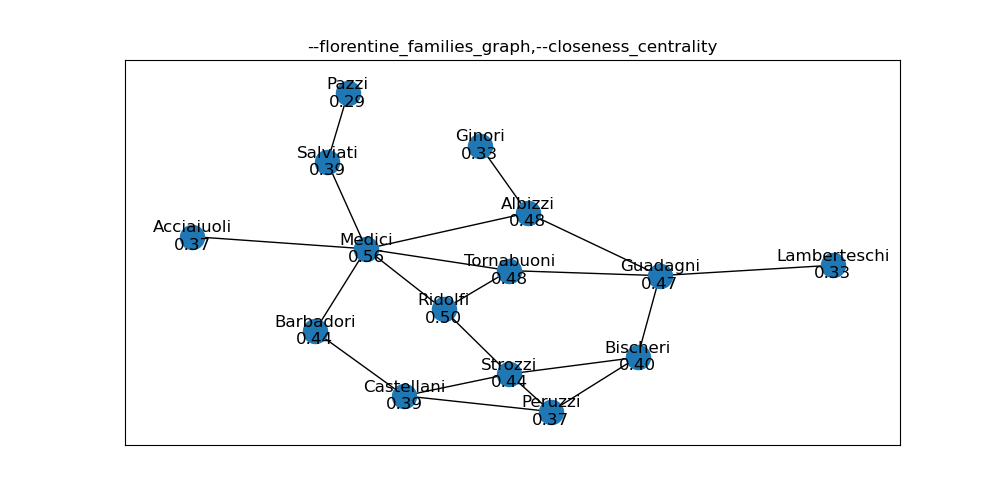|
||**Betweenness**|**Decay (Katz)**|
||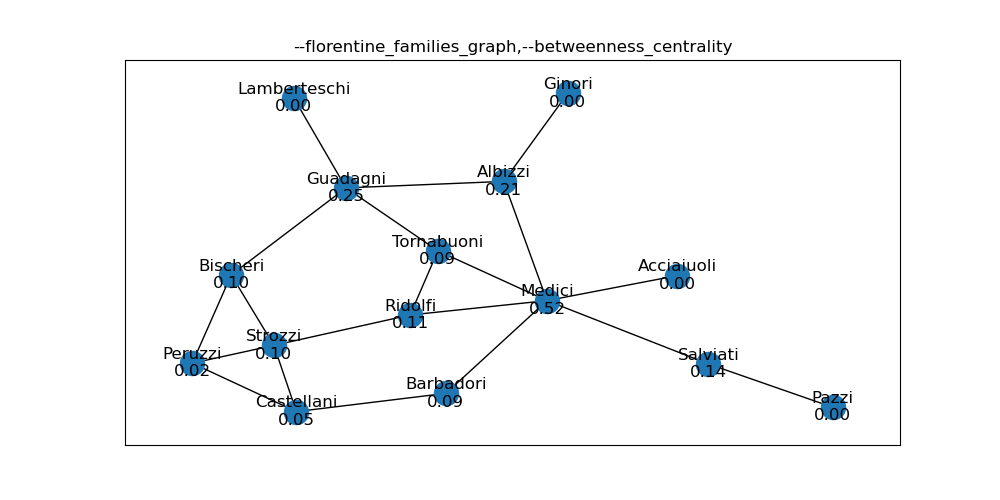|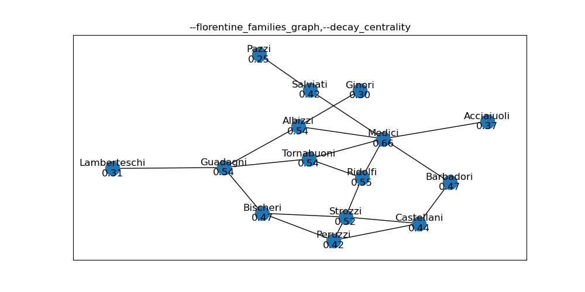|

###### References

Historical Description of the Medici family, others, and the time

https://www.destinationflorence.com/en/blog/292-the-medici-dynasty-the-intriguing-and-influential-florentine-family

https://en.wikipedia.org/wiki/House_of_Medici

Original social network analysis paper on these relationships

???

Dataset(s) and Tools

http://www.casos.cs.cmu.edu/computational_tools/datasets/external/padgett/index2.html

https://datarepository.wolframcloud.com/resources/Florentine-Families-Network/

https://www.wolfram.com/mathematica/new-in-9/social-network-analysis/centrality-and-prestige-of-florentine-families.html

https://networkx.org/documentation/latest/reference/generated/networkx.generators.social.florentine_families_graph.html#networkx.generators.social.florentine_families_graph

##### Lessons

[101](https://github.com/czrpb/networkanalysis/blob/main/learning/na101-basics/learn.md#centrality)

### Clique

Three nodes each connected to the other 2.

Aliases: *Triangle*

### Closeness (Centrality)

Closeness centrality measures the distance (or length) from ego to all other nodes.

$$
Cent^{C}_{i} = \frac {n-1} {\sum l(i, j)}
$$

Lessons: [101](https://github.com/czrpb/networkanalysis/blob/main/learning/na101-basics/learn.md#closeness)

### Complete

A network where there exists a dyad between all nodes.

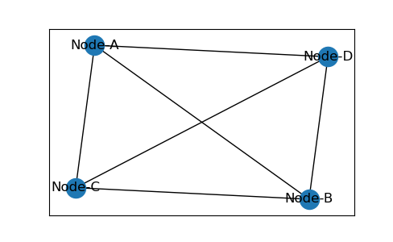

### Component

A connected set of nodes in a network where there are $\geq 2$ such sets.

### Connected

A set of nodes where there exists a path for all pairs of nodes.

### Cycle

A path that starts and ends at the same node.

See *Path*, *Walk*, *Geodesic*.

### Decay Centrality

A measure of a node's important where distance to another node attenuates. It is similar to closeness but the "weight" of edges is $0 \lt \delta \lt 1$.

$$
C_{i}^{\delta} = \frac {\delta(n-1)} {\sum \delta^{l_{i}}}
$$

### Degree

The number of edges connected to a node.

Lessons: [101](https://github.com/czrpb/networkanalysis/blob/main/learning/na101-basics/learn.md#degree)

### Degree Centrality

Degree centrality measures the node's importance on the number of edges it has.

$$Cent^{D}_{i} = \frac {d(i)} {n-1} $$

Lessons: [101](https://github.com/czrpb/networkanalysis/blob/main/learning/na101-basics/learn.md#degree)

### Density

### Digraph

See *Network*, specifically *Directed*.

### Distance

Distance the count of edges in a path between 2 nodes.

Aliases: *Length*

### Dyad

Two nodes connect by an edge.

### Edge

An *edge* is the relationship in a *dyad*.

Aliases: *Tie*

### Edge List

A common data structure to represent a network, implemented as a *list of 2-tuples*: `[(Node-A, Node-B), (Node-A, Node-C), (Node-B, Node-C)]`.

### Ego

Ego is often used as the "name" of or reference to a specific node that is under investigation.

### Geodesic

A shortest path between 2 nodes.

See *Path*, *Walk*, *Cycle*.

### Length

Alias for: *Distance*

### Network

A set of nodes connected by edges.

A network may be *undirected* or *directed*:

- Undirected: the relation between dyads' is symmetric/bi-directional
  - Social relations and economics are common examples
- Directed: the relation between dyads' is directional
  - Webpages and citations are common examples

Aliases: *Graph*

### Node

A node is one of the 2 primitive elements of a network.

Nodes are usually "things" or nouns such as:

- People - when part of a social network; other examples include:
  - Plants and animals in an ecosystem
  - Social media
- Computers - when part of a physical network; other examples include:
  - Cities, ports, stores, etc - as part of a transportation, distribution, supply chain
- Webpages - when part of an informational network; other examples include:
  - Academic papers, movie actors, 

Nodes are connected or related to each other via edges.

Aliases: *Vertex*

### Path

A path is a set of edges that connect 2 nodes, without repeating nodes.

See *Walk*, *Geodesic*, *Cycle*.

### Star

A network where there is 1 node connected to all other nodes and no other dyads exist.

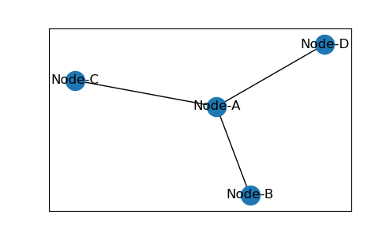

### Tie

Alias for: *Edge*.

### Triangle

Alias for: *Clique*.

### Vertex

Alias for: *Node*.

### Walk

A walk is a set of edges that connect 2 nodes, possibly repeating nodes.

See *Path*, *Geodesic*, *Cycle*.
