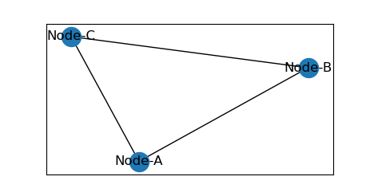

# Glossary of Network Terms

### Centrality

*Centrality* is a measure of a node's "importance" in the network.

Common measures are:

- Degree
- Closeness
- Betweenness
- Katz or Decay

Lessons: [101](https://github.com/czrpb/networkanalysis/blob/main/learning/na101-basics/learn.md#centrality)

### Clique

Three nodes each connected to the other 2.

Aliases: *Triangle*

### Closeness (Centrality)

Closeness centrality measures the distance (or length) from ego to all other nodes.

$$
Cent^{C}_{i} = \frac {n-1} {\sum l(i, j)}
$$

Lessons: [101](https://github.com/czrpb/networkanalysis/blob/main/learning/na101-basics/learn.md#closeness)

### Degree

The number of edges connected to a node.

Lessons: [101](https://github.com/czrpb/networkanalysis/blob/main/learning/na101-basics/learn.md#degree)

### Degree Centrality

Degree centrality measures the node's importance on the number of edges it has.

$$Cent^{D}_{i} = \frac {d(i)} {n-1} $$

Lessons: [101](https://github.com/czrpb/networkanalysis/blob/main/learning/na101-basics/learn.md#degree)

### Density

### Digraph

See *Network*, specifically *Directed*.

### Distance

Distance the count of edges in a path between 2 nodes.

Aliases: *Length*

### Dyad

Two nodes connect by an edge.

### Edge

An *edge* is the relationship in a *dyad*.

Aliases: *Tie*

### Edge List

A common data structure to represent a network, implemented as a *list of 2-tuples*: `[(Node-A, Node-B), (Node-A, Node-C), (Node-B, Node-C)]`.

### Ego

Ego is often used as the "name" of or reference to a specific node that is under investigation.

### Length

See *Distance*

### Network

A set of nodes connected by edges.

A network may be *undirected* or *directed*:

- Undirected: the relation between dyads' is symmetric/bi-directional
  - Social relations and economics are common examples
- Directed: the relation between dyads' is directional
  - Webpages and citations are common examples

Aliases: *Graph*

### Node

A node is one of the 2 primitive elements of a network.

Nodes are usually "things" or nouns such as:

- People - when part of a social network; other examples include:
  - Plants and animals in an ecosystem
  - Social media
- Computers - when part of a physical network; other examples include:
  - Cities, ports, stores, etc - as part of a transportation, distribution, supply chain
- Webpages - when part of an informational network; other examples include:
  - Academic papers, movie actors, 

Nodes are connected or related to each other via edges.

Aliases: *Vertex*

### Path

A path is a set of edges that connect 2 nodes.

### Tie

See *Edge*.

### Triangle

See *Clique*.

### Vertex

See *Node*.
