# Network Analysis 101: Basics

## Overview

### What is a network?

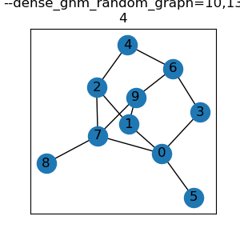

A [network](https://github.com/czrpb/networkanalysis/blob/main/glossary.md#network) is a set of [nodes](https://github.com/czrpb/networkanalysis/blob/main/glossary.md#node) and [edges](https://github.com/czrpb/networkanalysis/blob/main/glossary.md#edge)

|Node|Edge|

**Reading and Viewing**

https://en.wikipedia.org/wiki/Network_science

https://visiblenetworklabs.com/guides/network-science-101/

[Exploring Complex Networks](ref/2001-ExploringComplexNetworks-Strogatz.pdf)

##### Additional Material

[The Structure and Function of Complex Networks](ref/2003-TheStructureAndFunctionOfComplexNetworks-Newman.pdf)

> .

> .

\pagebreak

---

### Networks in the Real World

Networks are everywhere, such as:

- Information, ie: the Web
- Social, ie: Twitter, Facebook
- Biological, ie: Ecosystems, Neuronal, Metabolism

https://www.youtube.com/watch?v=yAtsm5xkb5c

\pagebreak

---

## Basic Network Analysis: Analytic

### Centrality

<table>
  <tr>
    <td></td>
    <td>
    
The basic analytic statistics on networks are measures that have their focus on nodes and their "importance" in the network.

     
    
The technical term for this is called <a href="https://github.com/czrpb/networkanalysis/blob/main/glossary.md#centrality">centrality</a> and thus these are <i>centrality measures</i>.

     
    
<a href="https://en.wikipedia.org/wiki/Centrality">https://en.wikipedia.org/wiki/Centrality</a>

     
    
<a href="https://www.youtube.com/watch?v=NgUj8DEH5Tc">https://www.youtube.com/watch?v=NgUj8DEH5Tc</a>

    </td>
  </tr>
</table>

\pagebreak

---

#### Degree

|The [degree](https://github.com/czrpb/networkanalysis/blob/main/glossary.md#degree) of a node is the number of connected edges|The most basic centrality statistics is called [degree centrality](https://github.com/czrpb/networkanalysis/blob/main/glossary.md#degree-centrality)|
|:-:|:-:|
|$$d(i) = \text{number of edges connected to node} \ i$$|$$C^{D}_{i} = \frac {d(i)} {n-1} $$|
|||

A related wholistic measure is [density]().

##### More Examples

Here are more networks, which will be used in later measures also as the above network is pretty simple.

||Star|Clique|Bridge|Complete|
|---|---|---|---|---|
|Degree||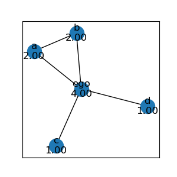|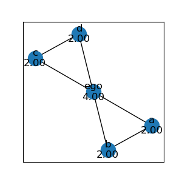|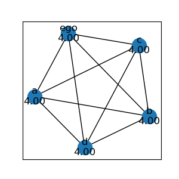|
|Degree Centrality|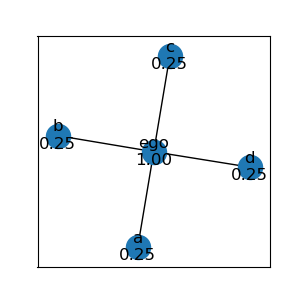|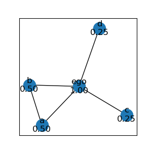|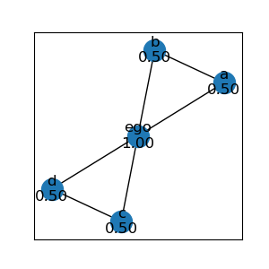|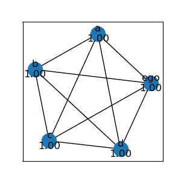|

\pagebreak

---

#### Closeness

[Closeness](https://github.com/czrpb/networkanalysis/blob/main/glossary.md#closeness-centrality) is a measure that means to capture a notion of proximity of a node to all other nodes.

So, if *ego* is 1 step away from all other nodes (ie: the center in a star network) the sum would be $n - 1$. Since generally we want measures $0 \leq c \leq 1$, let us consider this to be the maximum of $1$ and thus closeness would be defined as:

$$
Cent^{C}_{i} = \frac {n-1} {\sum l(i, j)}
$$

|$n-1$|$\sum l(i, j)$||
|:-:|:-:|:-:|
|3|3||

##### More Examples

||Star|Clique|Bridge|Complete|
|---|---|---|---|---|
|Closeness Centrality|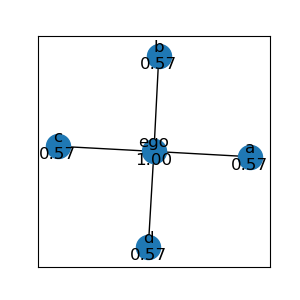|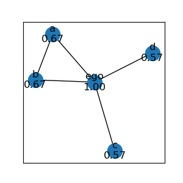|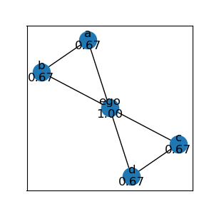|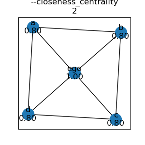|

##### References

https://www.youtube.com/watch?v=89mxOdwPfxA&t=810

\pagebreak

---

#### Decay

##### More Examples

||Star|Clique|Bridge|Complete|
|---|---|---|---|---|
|Decay Centrality|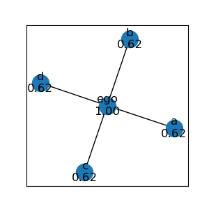|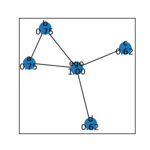|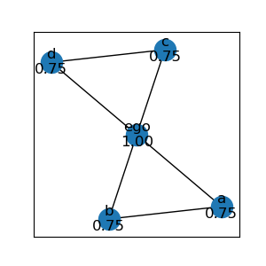|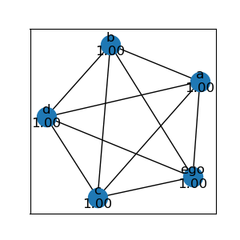|

\pagebreak

---

#### Betweenness

.

\pagebreak

---

## Basic Network Analysis: Synthetic

The basic synthetic, or wholistic, statistics on networks are measures meant to give information to the overall structure of the network.

\pagebreak

---

### Density

.

\pagebreak

---

### Clusters

.

\pagebreak

---
