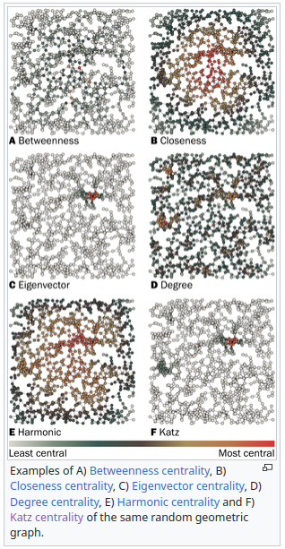
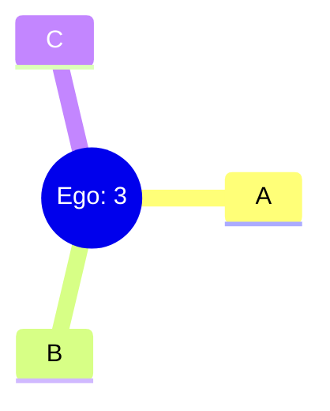
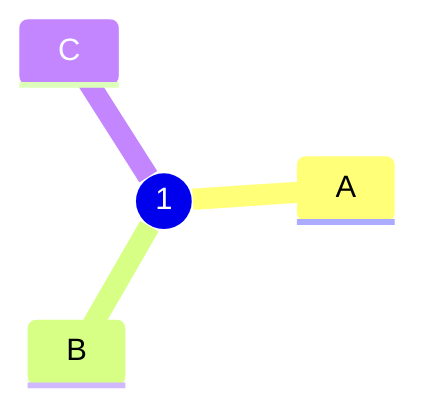

# Network Analysis 101: Basics

## Overview

### What is a network?

A network, or graph, are a set of *nodes* and *edges*:

> .

> .

### Networks in the Real World

Networks are everywhere, such as:

- Information, ie: the Web
- Social, ie: Twitter, Facebook
- Biological, ie: Ecosystems, Neuronal, Metabolism

https://www.youtube.com/watch?v=yAtsm5xkb5c

### Uses and Usefulness of Network Analysis

### Basic Network Analysis: Analytic

|||
|---|---|
||The basic analytic statistics on networks are measures that have their focus on nodes and their "importance" in the network. The technical term for this is called *centrality* and thus these are *centrality measures*.|

#### Degree

The *degree* of a node are the number of connected edges:

$$d\(i\) = \text{number of edges connected to node} \ i$$

The most basic centrality statistics is called *degree centrality*:

$$C^{D}_{i} = \frac {d\(i\)} {n-1} $$

##### Some Examples

Closeness

Betweenness

### Basic Network Analysis: Synthetic

The basic synthetic, or wholistic, statistics on networks are measures meant to give information to the overall structure of the network.

- Density

- Clusters

