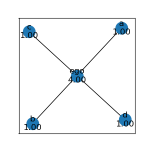
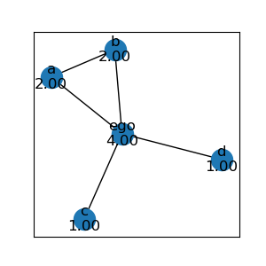
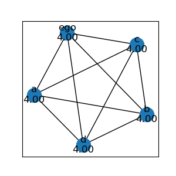

# Network Analysis 101: Basics

## Overview

### What is a network?

A network, or graph, are a set of *nodes* and *edges*:

> .

> .

### Networks in the Real World

Networks are everywhere, such as:

- Information, ie: the Web
- Social, ie: Twitter, Facebook
- Biological, ie: Ecosystems, Neuronal, Metabolism

https://www.youtube.com/watch?v=yAtsm5xkb5c

### Uses and Usefulness of Network Analysis

### Basic Network Analysis: Analytic

<table>
  <tr>
    <td></td>
    <td>
    
The basic analytic statistics on networks are measures that have their focus on nodes and their "importance" in the network.

     
    
The technical term for this is called <i>centrality</i> and thus these are <i>centrality measures</i>.

     

<a href="https://en.wikipedia.org/wiki/Centrality">https://en.wikipedia.org/wiki/Centrality</a>

    </td>
  </tr>
</table>

#### Degree

|The *degree* of a node is the number of connected edges|The most basic centrality statistics is called *degree centrality*|
|---|---|
|$$d(i) = \text{number of edges connected to node} \ i$$|$$C^{D}_{i} = \frac {d(i)} {n-1} $$|
|||

##### Some More Examples

Here are more networks, which will be used in later measures also as the above network is pretty simple.

|Star|Clique|Bridge|Complete|
|---|---|---|---|
|||||

Closeness

Betweenness

### Basic Network Analysis: Synthetic

The basic synthetic, or wholistic, statistics on networks are measures meant to give information to the overall structure of the network.

- Density

- Clusters

