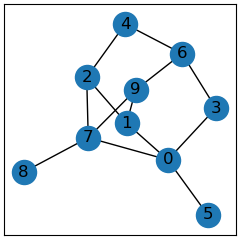

# Network Analysis 101: Basics

Quentin Crain

---

## Agenda

Networks

- by way of Example and Discussion
- in the Real World
- defined
- deconstructed
  - Centrality
- synthesized
  - Density
  - 

---

### Objectives

- Selfish: I love network science!
  - Practicing the Feynman method
- Educative: Want to spread the knowledge!
- Preferential: What sorts of presentations do people want?
  - "Academic" vs "Project"
  - "Informational" vs "Interactive"

---

### Let's Talk about this Network

|Most Important?|1|2|3|
|--:|---|---|---|

---

### Let's Talk about this Network

|"Centrality"|1|2|3|
|--:|---|---|---|
|Degree|**0.44**|0.19|0.25|
|Closeness|0.42|**0.46**|0.44|
|Betweenness|0.62|0.59|**0.65**|

---

### What is a network?

<table>
  <tr>
    <td></td>
    <td>A <i>network</i> is a set of <i>nodes</i> and <i>edges</i> that connect them.
      
    <i>Network Analysis</i> is the study of the *structure* of the network.</td>
    <td></td>
  </tr>
</table>

<table>
  <tr>
    <td colspan="2">
      https://en.wikipedia.org/wiki/Network_science
       
      <a href="ref/2003-TheStructureAndFunctionOfComplexNetworks-Newman.pdf">The Structure and Function of Complex Networks</a>
    </td>
  </tr>
  <tr>
    <td></td>
    <td></td>
  </tr>
</table>

---

### Networks in the Real World

<table>
  <tr><th colspan="3">Networks Everywhere</th>
  </tr>
  <tr>
    <td><u>Technological</u> The Internet</td>
    <td><u>Biological</u> Organisms/Metabolic</td>
    <td><u>Social</u> Florentine families</td>
  </tr>
  <tr>
    <td></td>
    <td></td>
    <td></td>
  </tr>
</table>

https://www.youtube.com/watch?v=yAtsm5xkb5c

---

## Basic Network Analysis: Analytic

### Centrality

<table>
  <tr>
    <td></td>
    <td>
    
The basic analytic statistics on networks are measures that have their focus on nodes and their "importance" in the network.

     
    
The technical term for this is called <a href="https://github.com/czrpb/networkanalysis/blob/main/glossary.md#centrality">centrality</a> and thus these are <i>centrality measures</i>.

     
    
<a href="https://en.wikipedia.org/wiki/Centrality">https://en.wikipedia.org/wiki/Centrality</a>

     
    
<a href="https://www.youtube.com/watch?v=NgUj8DEH5Tc">https://www.youtube.com/watch?v=NgUj8DEH5Tc</a>

    </td>
  </tr>
</table>

---

### Degree Centrality

|The *degree* of a node is the number of connected edges|The most basic centrality statistics is called *degree centrality*|
|:-:|:-:|
|$d(i) = \text{number of edges connected to node} \ i$|$C^{D}_{i} = \frac {d(i)} {n-1}$|
|||

A related wholistic measure is [density]().

---

#### Degree Centrality: More Examples

Here are more networks, which will be used in later measures also as the above network is pretty simple.

||Star|Clique|Bridge|Complete|
|---|---|---|---|---|
|Degree|||||
|Degree Centrality|||||

---

#### Closeness

[Closeness](https://github.com/czrpb/networkanalysis/blob/main/glossary.md#closeness-centrality) is a measure that means to capture a notion of proximity of a node to all other nodes.

So, if *ego* is 1 step away from all other nodes (ie: the center in a star network) the sum would be $n - 1$. Since generally we want measures $0 \leq c \leq 1$, let us consider this to be the maximum of $1$ and thus closeness would be defined as:

$$
Cent^{C}_{i} = \frac {n-1} {\sum l(i, j)}
$$

|$n-1$|$\sum l(i, j)$||
|:-:|:-:|:-:|
|3|3||

##### More Examples

||Star|Clique|Bridge|Complete|
|---|---|---|---|---|
|Closeness Centrality|||||

##### References

https://www.youtube.com/watch?v=89mxOdwPfxA&t=810

---

#### Decay

##### More Examples

||Star|Clique|Bridge|Complete|
|---|---|---|---|---|
|Decay Centrality|||||

---

#### Betweenness

.

---

## Basic Network Analysis: Synthetic

The basic synthetic, or wholistic, statistics on networks are measures meant to give information to the overall structure of the network.

---

### Density

.

---

### Clusters

.

---

### References

- Stanford CS102 class slide
  - https://web.stanford.edu/class/cs102/lectureslides/NetworksSlides.pdf
- Stanford CS224W class slides
  - https://web.stanford.edu/class/cs102/readings/CS224W-intro.pdf
- "Map" of the Internet from opte.org
  - http://content.opte.org/content/opte/maps/static/opte-2010.png
- Florentine families
  - https://journals.plos.org/plosone/article/figure?id=10.1371/journal.pone.0233276.g005
- Biological network image
  - https://www.ncbi.nlm.nih.gov/pmc/articles/PMC4833320/

---